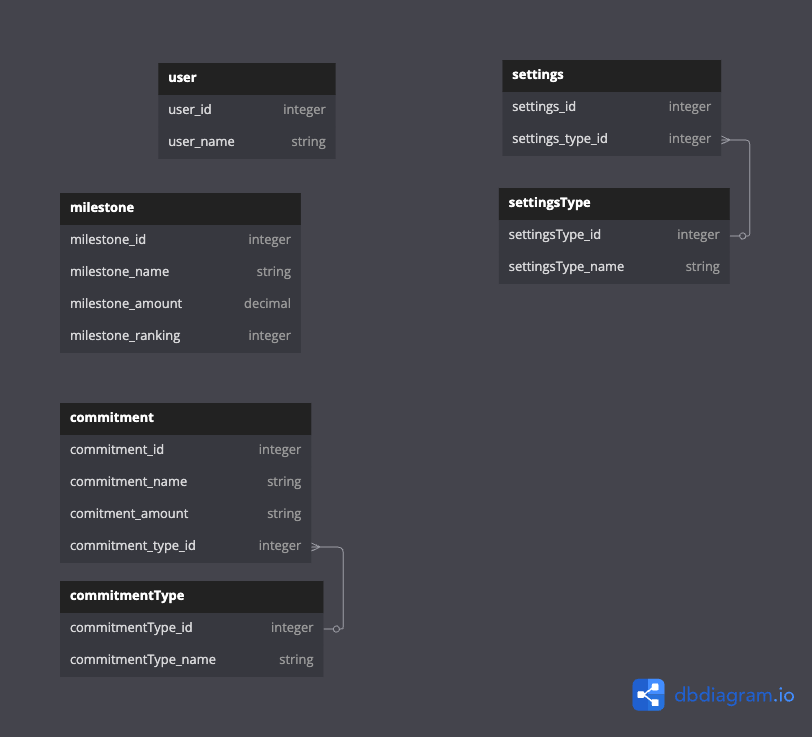

# Storing Data

## Premise
In order to enable configurable usage across the Ynab CLI, I need to be able to store custom data that I don't neccessarily rely on the YNAB API for.

I currently use spreadsheets to monitor things such as milestones, supplies I need to buy, etc. 

I use YNAB's 'farm' model quite thoroughly to manage my commitments, too, so I'd love to be able to monitor those commitments through this CLI rather than interpret their state from the YNAB interface.

## Problem
I don't currently have a data storage solution.

## Solution
### Database Provider
In order to avoid something too wide for what I'm ultimately trying to achieve here (unless in the future I want to provide logins... one step at a time), I chose SQL Lite to keep the database local to the user.

I like the idea of having multiple users able to use the same CLI by switching some kind of profile, but I still don't need a database server right now.

### Data Structure
I've gone with something fairly rudimentary:

## Constraints
TBC
## Questions & Answers
TBC